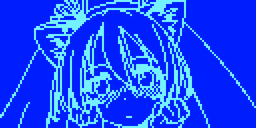

# marlin-anime
Anime boot screens for Marlin 2.x. Developed for the Ender 3 Pro.

	

## Installation

Follow the Marlin documentation at https://marlinfw.org/ for installation instructions. 

## Specifications

These were developed for the Ender 3 Pro (128px x 64px LCD). They are not guaranteed to work with any other printer.

The header files were created with the assistance of the [Marlin Bitmap Converter](https://marlinfw.org/tools/u8glib/converter.html).
